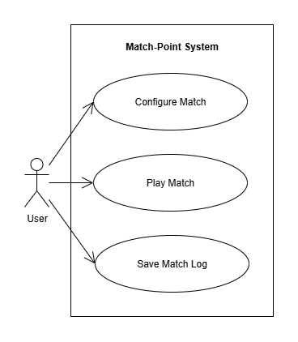
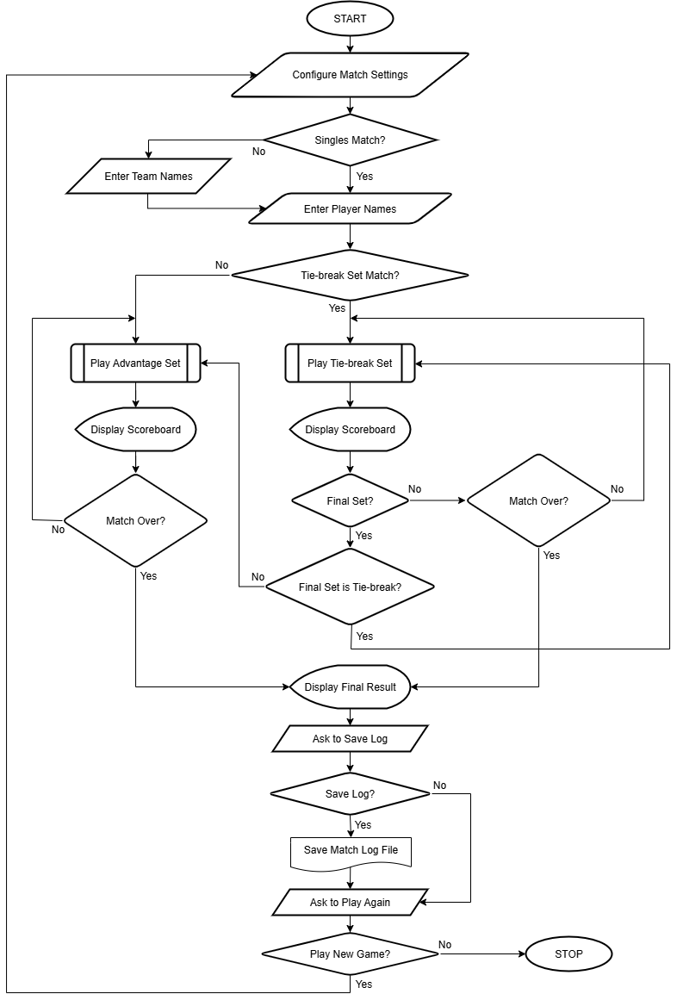

# Match-Point: 기술 설계 문서

## 1. 개요 (Overview)
Java 객체 지향 프로그래밍(OOP) 학습을 위한 콘솔 기반 테니스 스코어링 애플리케이션입니다. 요구사항 분석부터 설계, 구현, 테스트에 이르는 전체 개발 생명주기를 경험하는 것을 목표로 합니다.

> **프로젝트 관리 허브 :** [Notion Link](https://www.notion.so/MatchPoint-25ddc4b46fd5804cb033dda5d88b4cce?source=copy_link)

---

## 2. 아키텍처 (Architecture)

### 2.1. 아키텍처 패턴
이 프로젝트는 **계층형 아키텍처(Layered Architecture)**를 채택합니다.

* **선택 이유:**
    * **명확한 역할 분리:** 사용자 인터페이스(View), 비즈니스 로직(Controller), 데이터(Domain/Repository)의 책임이 명확하게 나뉘는 프로젝트의 요구사항과 가장 잘 부합합니다.
    * **학습 목표 달성:** 객체 지향의 SRP(단일 책임 원칙)를 학습하고 적용하기에 가장 교과서적이고 이상적인 구조입니다.
    * **적절한 복잡도:** 프로젝트의 규모에 비해 과도한 설계를 피하고, 가장 실용적이고 효율적인 구조를 제공합니다.

### 2.2. 패키지 구조
```java
com.matchpoint
├── view          // 사용자 입출력 담당
├── controller    // 비즈니스 로직 및 흐름 제어
├── domain        // 데이터 객체 (Player, Match 등)
└── repository    // 파일 저장 및 조회
```

---

## 3. 흐름 설계 (Flow Design)

### 3.1. 유스케이스 다이어그램

* 사용자는 경기를 설정하고, 진행하며, 그 결과를 저장하는 세 가지 주요 기능을 수행합니다.

### 3.2. 전체 애플리케이션 순서도

* 프로그램의 시작부터 종료, 그리고 재시작까지의 전체 생명주기를 보여줍니다. 이 흐름은 `MatchController`의 핵심 로직이 됩니다.

---

## 4. 클래스 설계 (Class Design)

### 4.1. 클래스 다이어그램


### 4.2. 핵심 클래스의 역할과 책임 (R&R)

* **`MatchController`**
    * **역할:** 전체 경기 흐름을 지휘하는 '감독'.
    * **책임:**
        * `View`로부터 사용자 입력을 받아 `Domain` 객체에 전달.
        * 경기 규칙에 따라 승패를 판정하고 `Domain` 객체의 상태를 변경.
        * 업데이트된 결과를 `View`에 전달하여 화면 출력을 지시.
* **`ConsoleView`**
    * **역할:** 사용자와 직접 소통하는 '인터페이스'.
    * **책임:**
        * 사용자에게 질문을 출력.
        * 사용자의 키보드 입력을 받아 `Controller`에 전달.
        * `Controller`로부터 받은 데이터를 화면에 출력.
* **`Match`, `Set`, `Game`, `Player` (Domain Objects)**
    * **역할:** 경기와 관련된 '데이터'를 보관하는 객체.
    * **책임:**
        * 경기, 세트, 게임, 선수와 관련된 상태 정보(점수, 이름 등)를 가짐.
* **`MatchLogRepository`**
    * **역할:** 경기 기록을 파일에 저장하고 읽어오는 '창고 관리자'.
    * **책임:**
        * `Match` 객체의 데이터를 받아 텍스트 파일 형식으로 변환하고 저장.

---

## 5. 데이터 포맷 (Data Format)

### 5.1. 경기 로그 파일 형식
경기 로그는 사람이 쉽게 읽을 수 있는 서술형 텍스트 형식(Narrative Log)을 따릅니다.
```
[Game 1] Point 1: Player A scored. (15-0)
[Game 1] Point 2: Player A scored. (30-0)
...
```